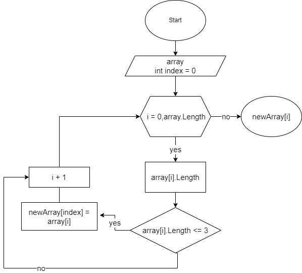

# Решение итоговой контрольной работы
1. __Создали репозиторий на GitHub.__
2. __Решение задачи__
## Описание задачи:
_Задача: Написать программу, которая из имеющегося массива строк формирует новый массив из строк, длина которых меньше, либо равна 3 символам. Первоначальный массив можно ввести с клавиатуры, либо задать на старте выполнения алгоритма. При решении не рекомендуется пользоваться коллекциями, лучше обойтись исключительно массивами._
## Решение задачи:
 Сначала просим пользователя ввести элементы исходного массива через пробелы с помощью метода __Console.ReadLine()__. Мы используем метод __String.Split()__ - для разделения введенной строки на отдельные элементы массива.
 Затем мы создаем пустой массив строк __newArray__, который будет содержать новые строки.
 В цикле __for__ мы проверяем каждую строку на длину и, если длина меньше или равна 3, мы добавляем ее в конец нового массива. В конце мы меняем размер нового массива на количество строк, которые мы добавили, чтобы избежать пустых элементов массива.
 Затем мы выводим оба массива строк на экран с помощью двух других циклов __for__.

3. __Нарисовать блок-схему к задаче__

